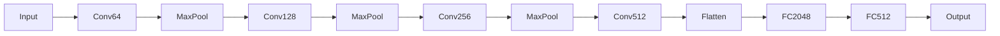
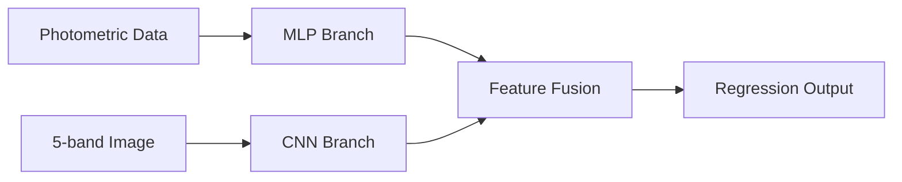

# Galaxy Morphology Classification and Redshift Estimation

## Project Overview
This repository contains deep learning models for:
1. **Galaxy Morphology Classification**: Classifying galaxy images into 10 morphological types using CNN
2. **Redshift Estimation**: Predicting galaxy redshifts using photometric data and multi-band images

Trained on the Galaxy ML dataset for automated astronomical analysis.

## Features
### Morphology Classification
- VGG-style CNN with batch normalization
- Class-weighted loss handling
- 5-fold cross-validation
- Data augmentation
- Early stopping & learning rate scheduling

### Redshift Estimation
- Hybrid MLP-CNN architecture
- Processes 5-band images (g, r, i, z, y)
- Photometric parameter integration
- Robust Smooth L1 loss

## Installation
```bash
# Clone repository
git clone https://github.com/yourusername/galaxy-ml-project.git
cd galaxy-ml-project

# Install dependencies
pip install -r requirements.txt


```
## DashBoard
A dashboard to retrieve images and photometric redshift values from the SDSS API, and display the classification and redshift value of the retrieved image. Images can be retrieved by using sky co-ordinates of a certain galaxy.
## Model Architectures
### Morphology Classifier


### Redshift Estimator



```

